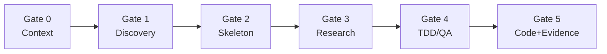

# Slowmode — Hardcore Dev Harness Skill

[](./LICENSE)
[](./skills/hardcore-dev-harness/SKILL.md)

[English](./README.md) | [简体中文](./README.zh.md)

> A portable **Agent Skill** that turns any coding agent into a **Chief Product Officer + Senior Architecture Reviewer** — context-first, evidence-gated, ledger-tracked. No business code until requirements, skeleton, research, and tests are in place.

**Slow down on purpose. Ship a real MVP — least code, cleanest atomic modules, zero hidden defects.**

---

## Table of contents

- [Quick start](#quick-start)
- [What this is](#what-this-is)
- [What it fixes](#what-it-fixes)
- [Supported agents](#supported-agents)
- [The Gates](#the-gates)
- [Entry modes](#entry-modes)
- [Install](#install)
- [Use in your project](#use-in-your-project)
- [Day-to-day prompts](#day-to-day-prompts)
- [Philosophy](#philosophy)
- [Sub-agent delegation](#sub-agent-delegation)
- [FEATURES.md ledger](#featuresmd-ledger)
- [Examples](#examples)
- [Repository layout](#repository-layout)
- [Optional: codegraph](#optional-codegraph)
- [Customize](#customize)
- [FAQ](#faq)
- [Issues & contributing](#issues--contributing)
- [License](#license)

---

## Quick start

**Fastest path (Cursor project rule):**

```bash
git clone https://github.com/lz10081/slowmode.git
cd slowmode && ./scripts/install.sh cursor-rule /path/to/your-app
```

Or without cloning:

```bash
mkdir -p /path/to/your-app/.cursor/rules
curl -fsSL -o /path/to/your-app/.cursor/rules/hardcore-dev-harness.mdc \
  https://raw.githubusercontent.com/lz10081/slowmode/main/.cursor/rules/hardcore-dev-harness.mdc
```

**First message in any new chat:**

```text
Mode: feature_iter — <your task>. Start Gate 0.
```

**Seed your app ledger (once per repo):**

```bash
curl -fsSL -o FEATURES.md \
  https://raw.githubusercontent.com/lz10081/slowmode/main/templates/FEATURES.md
```

---

## What this is

Slowmode is **not** an app or npm package. It is a set of markdown instructions you drop into your agent:

| Artifact | Use |
|----------|-----|
| `skills/hardcore-dev-harness/SKILL.md` | Full skill (Amp, Cursor Agent Skills) |
| `CLAUDE.md` | Single-file drop-in (Claude Code, `AGENTS.md`, Custom Instructions) |
| `.cursor/rules/hardcore-dev-harness.mdc` | Cursor / Windsurf project rule |

The agent follows a **6-gate workflow** (Gate 0 every chat) so work is planned, researched, tested, evidenced, and written into `FEATURES.md` for the next session.

---

## What it fixes

| Failure mode | Slowmode response |
|--------------|-------------------|
| Rebuilds features that already exist | Gate 0: read ledger + declare `REUSE` / `EXTEND` / `NEW` / `REPLACE` |
| Next session starts from zero | Gate 5: append-only `FEATURES.md` ledger |
| "Tests pass" but code is broken | Evidence gate: paste runner output + real invocation |
| Pivot = full rewrite | Swappable folders + `CONTRACT.md` per feature |
| Long chat loses context | One chat = one feature; fresh chat after Gate 5 |
| Sub-agents re-read everything | 5-field delegation brief + compact return only |

---

## Supported agents

| Platform | Install option | File / path |
|----------|----------------|-------------|
| **Cursor** | C or E | `.cursor/rules/hardcore-dev-harness.mdc` or `.cursor/skills/hardcore-dev-harness/` |
| **Windsurf** | C | Same `.mdc` rule pattern |
| **Claude Code** | B | `CLAUDE.md` at repo root |
| **OpenAI Codex / Amp** | B or A | `AGENTS.md` or Amp skill symlink |
| **Cline / Continue** | B or D | Paste `CLAUDE.md` into Custom Instructions |
| **GitHub Copilot** | D | Custom instructions (paste `CLAUDE.md`) |
| **ChatGPT / Claude / Gemini GPT** | D | System prompt / Instructions field |

Stack-agnostic: TypeScript, Python, Go, Rust, mobile, etc. The skill only defines **process**, not language.

---

## The Gates



| Gate | Forces you to… | Blocked until |
|------|----------------|---------------|
| **0** | Read `FEATURES.md` + repo; declare `REUSE` / `EXTEND` / `NEW` / `REPLACE` | Plan declared |
| **1** | MVP boundary via Socratic Q (1–2 at a time) | User confirms MVP doc |
| **2** | Swappable skeleton: folder + `CONTRACT.md` per feature | User confirms skeleton |
| **3** | Web-check official docs; compare options | User picks approach |
| **4** | ≥3 edge tests **before** implementation | Tests defined |
| **5** | Fail-Fast code; paste test + invocation output; update ledger | Evidence + ledger |

**Trivial Fast Path:** ≤30 LOC, single file, reversible → **Gate 0 + Gate 5 only**.

---

## Entry modes

Declare at the **start of every chat** (after Gate 0):

| Mode | Starts at | When |
|------|-----------|------|
| `new_project` | Gate 1 | Brand-new product / major suite |
| `feature_iter` | Gate 3 | One feature on existing skeleton (default) |
| `refactor` | Gate 3 | Rewrite module (paste dir tree + data flow first) |
| `debug_qa` | Gate 4 | Bug hunt / QA hardening |

---

## Install

Pick **one** primary surface for your agent. You can combine rule + skill on Cursor.

### Option A — Amp Skill

```bash
./scripts/install.sh amp-skill
# or manually:
mkdir -p ~/.config/amp/skills
git clone https://github.com/lz10081/slowmode.git ~/.config/amp/skills/_slowmode
ln -s ~/.config/amp/skills/_slowmode/skills/hardcore-dev-harness \
      ~/.config/amp/skills/hardcore-dev-harness
```

Thread opener: `Mode: new_project — I want to build X. Load skill hardcore-dev-harness.`

### Option B — Claude Code / AGENTS.md (per project)

```bash
./scripts/install.sh claude-md /path/to/your-app
# or:
curl -fsSL -o CLAUDE.md https://raw.githubusercontent.com/lz10081/slowmode/main/CLAUDE.md
```

Use `AGENTS.md` instead of `CLAUDE.md` if your stack expects that name.

### Option C — Cursor / Windsurf rule

```bash
./scripts/install.sh cursor-rule /path/to/your-app
# or:
mkdir -p .cursor/rules
curl -fsSL -o .cursor/rules/hardcore-dev-harness.mdc \
  https://raw.githubusercontent.com/lz10081/slowmode/main/.cursor/rules/hardcore-dev-harness.mdc
```

Enable the rule in Cursor Rules, or `@hardcore-dev-harness` when starting a task.

### Option D — Custom Instructions (any agent)

Copy the full contents of [`CLAUDE.md`](./CLAUDE.md) into Custom Instructions / System Prompt.

### Option E — Cursor Agent Skill (recommended for Cursor)

**Personal** (all projects):

```bash
git clone https://github.com/lz10081/slowmode.git
cd slowmode && ./scripts/install.sh cursor-skill
```

**Per-repo** (commit with your team):

```bash
./scripts/install.sh project-skill /path/to/your-app
```

Skill path: `.cursor/skills/hardcore-dev-harness/SKILL.md` or `~/.cursor/skills/hardcore-dev-harness/SKILL.md`.

### Install helper (all targets)

```bash
git clone https://github.com/lz10081/slowmode.git
cd slowmode
./scripts/install.sh --help
```

One-liner without clone:

```bash
curl -fsSL https://raw.githubusercontent.com/lz10081/slowmode/main/scripts/install.sh | bash -s -- cursor-rule
```

---

## Use in your project

Slowmode runs in **your application repo**, not only in this skill repo.

1. **Install** one agent surface (above).
2. **Add** `FEATURES.md` at repo root ([template](./templates/FEATURES.md)).
3. **Optional:** add `CLAUDE.md` / `AGENTS.md` with project-specific rules under the harness.
4. **Open a new chat per feature** with `Mode: …` and let Gate 0 run first.

After Gate 2 (new projects), each feature lives in its own folder:

```text
features/my-feature/
├── index.ts          # only public entry
└── CONTRACT.md       # 5 lines: Inputs / Outputs / Side-effects / Deps / Replaces
```

Copy [`templates/CONTRACT.md`](./templates/CONTRACT.md) when creating a feature folder.

---

## Day-to-day prompts

**New project**

```text
Mode: new_project — I want to build a high-frequency trading log app. Start Gate 1.
```

**One feature (fresh chat)**

```text
Mode: feature_iter — Skeleton ready. Build swipe-to-delete ledger card. Start Gate 3.
```

**Refactor**

```text
Mode: refactor — Dir tree and data flow: [paste]. Start Gate 3.
```

**Debug / QA**

```text
Mode: debug_qa — Component fails on empty API responses. Start Gate 4.
```

If the agent skips Gate 0 or claims done without pasted test output, point it to [EXAMPLES.md](./EXAMPLES.md) and ask it to redo the gate.

---

## Philosophy

1. **Context First** — read `FEATURES.md` + repo before reasoning.
2. **Discovery First** — cheap thinking now beats expensive recoding later.
3. **Swappable Modules** — pivot = swap folder matching `CONTRACT.md`.
4. **Research-Driven** — verify current official docs per feature.
5. **Fail-Fast + Evidence-Gated** — no silent `{}`/`[]`; no "tests pass" without proof.

---

## Sub-agent delegation

Main agent stays PM. Sub-agent brief **must** include all five fields:

```text
Goal:           <one sentence>
Files to READ:  <specific paths>
Do NOT re-read: <already in main context>
Constraints:    <non-goals, style, tests>
Return shape:   outcome | files changed | evidence | blockers | next step
```

Main agent **never** delegates: Gate 0, Gate 1, final integration, Gate 5 self-review, `FEATURES.md` updates.

See [EXAMPLES.md §5](./EXAMPLES.md#5-delegation-brief-main-agent--sub-agent).

---

## FEATURES.md ledger

Lives at **your app repo root**. Every Gate 5 completion appends one block:

```markdown
## <feature-name>  (added YYYY-MM-DD, supersedes: <prev|none>)
- Location:        <path/to/feature/>
- Public API:      <signatures or endpoints>
- Inputs/Outputs:  <one line, mirrors CONTRACT.md>
- Edge cases tested: <bullet list>
- Verified by:     <exact command>
- Notes:           <gotchas a future agent must know>
```

Historical blocks are **immutable** — corrections use a new block with `supersedes:`.

---

## Examples

**[EXAMPLES.md](./EXAMPLES.md)** — canonical shapes for Gate 0 opener, `CONTRACT.md`, ledger block, evidence paste, delegation brief, agree/disagree, before/after, Trivial Fast Path.

If agent output does not match those shapes, push back.

---

## Repository layout

```text
slowmode/
├── README.md                          ← English (this file)
├── README.zh.md                       ← 中文
├── LICENSE                            ← MIT
├── CONTRIBUTING.md
├── CLAUDE.md                          ← single-file drop-in
├── EXAMPLES.md                        ← worked examples
├── FEATURES.md                        ← ledger for this skill repo (demo)
├── templates/
│   ├── FEATURES.md                    ← copy into your app
│   └── CONTRACT.md                    ← per-feature template
├── scripts/
│   └── install.sh                     ← install helper
├── .github/ISSUE_TEMPLATE/            ← bug / feature / question
├── .cursor/rules/
│   └── hardcore-dev-harness.mdc       ← Cursor rule
└── skills/
    └── hardcore-dev-harness/
        └── SKILL.md                   ← full skill + version frontmatter
```

---

## Optional: codegraph

If [codegraph](https://github.com/colbymchenry/codegraph) is installed (`npx @colbymchenry/codegraph` + `codegraph init -i`), Gate 0 prefers `codegraph_context` / `codegraph_search` over grep (~70% fewer tool calls). Slowmode works without it.

---

## Customize

Append project rules under the imported skill or in `CLAUDE.md`:

```markdown
## Project-Specific Rules
- TypeScript strict mode
- All API endpoints must have Vitest tests
- Errors follow src/utils/errors.ts
```

---

## FAQ

**Do I need to clone this repo into every project?**  
No. Copy one surface (`CLAUDE.md`, `.mdc`, or skill folder) or run `install.sh` once per app.

**Will the agent slow down every typo fix?**  
No. Trivial Fast Path skips Gates 1–4 for ≤30 LOC single-file reversible edits.

**What if I don't have FEATURES.md yet?**  
Gate 0 offers to scaffold from [templates/FEATURES.md](./templates/FEATURES.md).

**Cursor rule vs Cursor skill?**  
Rule = project-scoped, easy to enable per repo. Skill = richer description for agent auto-invocation; use personal or project skill path.

**How do I update Slowmode?**  
Re-run `curl` / `install.sh` or `git pull` on your clone. Check `version` in `SKILL.md` frontmatter.

---

## Issues & contributing

| Action | Link |
|--------|------|
| Report a bug | [Bug report](https://github.com/lz10081/slowmode/issues/new?template=bug_report.yml) |
| Suggest improvement | [Feature request](https://github.com/lz10081/slowmode/issues/new?template=feature_request.yml) |
| Ask a question | [Question](https://github.com/lz10081/slowmode/issues/new?template=question.yml) |
| Contribute | [CONTRIBUTING.md](./CONTRIBUTING.md) |

---

## License

[MIT](./LICENSE) — use, fork, and ship in your own projects freely.
