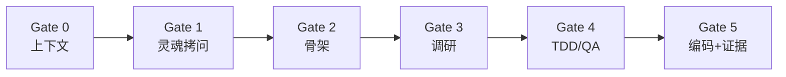

# Slowmode — 硬核开发门禁技能（Hardcore Dev Harness）

[](./LICENSE)
[](./skills/hardcore-dev-harness/SKILL.md)

[English](./README.md) | [简体中文](./README.zh.md)

> 一套可移植的 **Agent Skill**，把任何 AI 编程助手变成 **首席产品官 + 资深架构审查员** —— 上下文先行、证据闭环、Ledger 留痕。需求、骨架、调研、测试没到位之前，**不写业务代码**。

**故意慢下来，才能真的快** —— 最少代码、最干净的原子模块、零隐藏缺陷。

---

## 目录

- [快速开始](#快速开始)
- [这是什么](#这是什么)
- [解决什么问题](#解决什么问题)
- [支持的 Agent](#支持的-agent)
- [门禁流程](#门禁流程)
- [场景入口 Mode](#场景入口-mode)
- [安装](#安装)
- [在你的项目里使用](#在你的项目里使用)
- [日常 Prompt](#日常-prompt)
- [核心哲学](#核心哲学)
- [Sub-agent 委派](#sub-agent-委派)
- [FEATURES.md 账本](#featuresmd-账本)
- [范例](#范例)
- [仓库结构](#仓库结构)
- [可选：codegraph](#可选codegraph)
- [自定义](#自定义)
- [常见问题](#常见问题)
- [反馈与贡献](#反馈与贡献)
- [协议](#协议)

---

## 快速开始

**最快路径（Cursor 项目规则）：**

```bash
git clone https://github.com/lz10081/slowmode.git
cd slowmode && ./scripts/install.sh cursor-rule /path/to/your-app
```

或不克隆仓库：

```bash
mkdir -p /path/to/your-app/.cursor/rules
curl -fsSL -o /path/to/your-app/.cursor/rules/hardcore-dev-harness.mdc \
  https://raw.githubusercontent.com/lz10081/slowmode/main/.cursor/rules/hardcore-dev-harness.mdc
```

**每次新聊天的第一句话：**

```text
Mode: feature_iter — <你的任务>. 启动 Gate 0.
```

**给应用仓库种一份账本（每个 repo 一次）：**

```bash
curl -fsSL -o FEATURES.md \
  https://raw.githubusercontent.com/lz10081/slowmode/main/templates/FEATURES.md
```

---

## 这是什么

Slowmode **不是**应用，也 **不是** npm 包。它是你放进 Agent 的 **markdown 指令集**：

| 文件 | 用途 |
|------|------|
| `skills/hardcore-dev-harness/SKILL.md` | 完整 Skill（Amp、Cursor Agent Skills） |
| `CLAUDE.md` | 单文件版（Claude Code、`AGENTS.md`、自定义指令） |
| `.cursor/rules/hardcore-dev-harness.mdc` | Cursor / Windsurf 项目规则 |

Agent 按 **6 道门禁** 工作（每次开聊必跑 Gate 0），保证有计划、有调研、有测试、有证据，并写入 `FEATURES.md` 供下次 session 冷启动。

---

## 解决什么问题

| 痛点 | Slowmode 对策 |
|------|----------------|
| 重复造已有功能 | Gate 0：读账本 + 声明 `REUSE` / `EXTEND` / `NEW` / `REPLACE` |
| 下个 session 从零查 | Gate 5：只追加的 `FEATURES.md` |
| 「测试过了」但代码是坏的 | 证据门禁：贴 runner 输出 + 真实调用 |
| Pivot = 整体重写 | 可替换文件夹 + 每功能一份 `CONTRACT.md` |
| 长聊丢上下文 | 一个聊天一个功能；Gate 5 后开新聊 |
| Sub-agent 重复读文件 | 5 字段 brief + 只返回紧凑报告 |

---

## 支持的 Agent

| 平台 | 安装方案 | 路径 |
|------|----------|------|
| **Cursor** | C 或 E | `.cursor/rules/hardcore-dev-harness.mdc` 或 `.cursor/skills/hardcore-dev-harness/` |
| **Windsurf** | C | 同上 `.mdc` |
| **Claude Code** | B | 仓库根目录 `CLAUDE.md` |
| **OpenAI Codex / Amp** | B 或 A | `AGENTS.md` 或 Amp skill 符号链接 |
| **Cline / Continue** | B 或 D | 把 `CLAUDE.md` 贴进 Custom Instructions |
| **GitHub Copilot** | D | 自定义指令（贴 `CLAUDE.md`） |
| **ChatGPT / Claude / Gemini GPT** | D | System Prompt / Instructions |

与技术栈无关：TS、Python、Go、Rust、移动端等均可，Skill 只规定 **流程**。

---

## 门禁流程



| 门禁 | 强制做的事 | 卡死直到 |
|------|------------|----------|
| **0** | 读 `FEATURES.md` + 仓库；声明 `REUSE` / `EXTEND` / `NEW` / `REPLACE` | 计划已声明 |
| **1** | 苏格拉底式 MVP 边界（每次 1–2 问） | 用户确认 MVP 文档 |
| **2** | 可替换骨架：每功能一文件夹 + `CONTRACT.md` | 用户确认骨架 |
| **3** | 联网核对官方文档；方案对比 | 用户选定方案 |
| **4** | 实现前先写 ≥3 个边界测试 | 测试已定义 |
| **5** | Fail-Fast 编码；贴测试与调用输出；更新账本 | 证据 + ledger |

**Trivial Fast Path：** ≤30 行、单文件、可逆 → **只跑 Gate 0 + Gate 5**。

---

## 场景入口 Mode

每次开聊声明（Gate 0 之后生效）：

| 模式 | 起始门禁 | 场景 |
|------|----------|------|
| `new_project` | Gate 1 | 新项目 / 大套件 |
| `feature_iter` | Gate 3 | 骨架上增一个小功能（默认） |
| `refactor` | Gate 3 | 重写模块（先贴目录树与数据流） |
| `debug_qa` | Gate 4 | 抓 Bug / QA 加固 |

---

## 安装

为你的 Agent **选一种** 主入口。Cursor 可同时用规则 + Skill。

### 方案 A — Amp Skill

```bash
./scripts/install.sh amp-skill
```

开聊：`Mode: new_project — 我要做 X，请加载 hardcore-dev-harness 技能。`

### 方案 B — Claude Code / AGENTS.md

```bash
./scripts/install.sh claude-md /path/to/your-app
```

若工具链要求 `AGENTS.md`，用同名文件即可。

### 方案 C — Cursor / Windsurf 规则

```bash
./scripts/install.sh cursor-rule /path/to/your-app
```

在 Cursor Rules 中启用，或任务开始时 `@hardcore-dev-harness`。

### 方案 D — 自定义指令

将 [`CLAUDE.md`](./CLAUDE.md) 全文贴入 Custom Instructions / System Prompt。

### 方案 E — Cursor Agent Skill（Cursor 用户推荐）

**个人级（所有项目）：**

```bash
git clone https://github.com/lz10081/slowmode.git
cd slowmode && ./scripts/install.sh cursor-skill
```

**仓库级（团队共享）：**

```bash
./scripts/install.sh project-skill /path/to/your-app
```

路径：`.cursor/skills/hardcore-dev-harness/SKILL.md` 或 `~/.cursor/skills/hardcore-dev-harness/SKILL.md`。

### 安装脚本

```bash
git clone https://github.com/lz10081/slowmode.git
cd slowmode
./scripts/install.sh --help
```

不克隆的一行命令：

```bash
curl -fsSL https://raw.githubusercontent.com/lz10081/slowmode/main/scripts/install.sh | bash -s -- cursor-rule
```

---

## 在你的项目里使用

Slowmode 装在 **你的应用仓库** 里，不限于本 Skill 分发仓库。

1. 按上文 **安装** 一种 Agent 入口。
2. 在应用根目录添加 `FEATURES.md`（[模板](./templates/FEATURES.md)）。
3. **可选：** 在 `CLAUDE.md` / `AGENTS.md` 里追加项目专属规则。
4. **每个功能开新聊天**，第一句带 `Mode: …`，让 Gate 0 先跑。

Gate 2 之后，每个功能一个目录：

```text
features/my-feature/
├── index.ts
└── CONTRACT.md    # 5 行：Inputs / Outputs / Side-effects / Deps / Replaces
```

新建功能时复制 [`templates/CONTRACT.md`](./templates/CONTRACT.md)。

---

## 日常 Prompt

**新项目**

```text
Mode: new_project — 我要做一个高频交易日志 App，启动 Gate 1.
```

**单个功能（新聊天）**

```text
Mode: feature_iter — 骨架已就绪，做滑动删除记账卡片，启动 Gate 3.
```

**重构**

```text
Mode: refactor — 目录树与数据流：[粘贴]. 启动 Gate 3.
```

**Debug**

```text
Mode: debug_qa — 空 API 响应时崩溃，启动 Gate 4.
```

若 Agent 跳过 Gate 0 或无测试输出就声称完成，请对照 [EXAMPLES.md](./EXAMPLES.md) 要求重做。

---

## 核心哲学

1. **上下文先行** — 先读 `FEATURES.md` 与仓库现状。
2. **设计先行** — 用思考换少改代码。
3. **模块可替换** — Pivot = 换文件夹且 `CONTRACT` 对齐。
4. **调研先行** — 每功能核对当前官方文档。
5. **Fail-Fast + 证据闭环** — 禁止静默兜底；禁止无粘贴的「测试通过」。

---

## Sub-agent 委派

Main agent 当 PM。Brief **必须** 含五个字段：

```text
Goal:           <一句话>
Files to READ:  <路径>
Do NOT re-read: <已在主上下文>
Constraints:    <非目标、风格、测试>
Return shape:   outcome | files changed | evidence | blockers | next step
```

Main agent **永不外包**：Gate 0、Gate 1、最终集成、Gate 5 自审、`FEATURES.md` 更新。

详见 [EXAMPLES.md §5](./EXAMPLES.md#5-delegation-brief-main-agent--sub-agent)。

---

## FEATURES.md 账本

放在 **应用仓库根目录**。每次 Gate 5 追加一段：

```markdown
## <feature-name>  (added YYYY-MM-DD, supersedes: <prev|none>)
- Location:        <path/to/feature/>
- Public API:      <signatures or endpoints>
- Inputs/Outputs:  <one line, mirrors CONTRACT.md>
- Edge cases tested: <bullet list>
- Verified by:     <exact command>
- Notes:           <gotchas>
```

历史段落 **不可改**；更正用新段落 + `supersedes:`。

---

## 范例

**[EXAMPLES.md](./EXAMPLES.md)** — Gate 0 开场、CONTRACT、账本块、证据粘贴、委派 brief、agree/disagree、前后对比、快速通道。

产出形状不对就 **打回去**。

---

## 仓库结构

```text
slowmode/
├── README.md / README.zh.md
├── LICENSE
├── CONTRIBUTING.md
├── CLAUDE.md
├── EXAMPLES.md
├── FEATURES.md              ← 本仓库 Skill 的 demo 账本
├── templates/               ← 复制到你的应用
├── scripts/install.sh
├── .github/ISSUE_TEMPLATE/
├── .cursor/rules/hardcore-dev-harness.mdc
└── skills/hardcore-dev-harness/SKILL.md
```

---

## 可选：codegraph

安装 [codegraph](https://github.com/colbymchenry/codegraph) 后，Gate 0 优先用语义搜索，工具调用约减 70%。未安装则自动回退 grep，**不影响 Slowmode 本身**。

---

## 自定义

在 `CLAUDE.md` 或 Skill 末尾追加：

```markdown
## 项目专属规则
- TypeScript 严格模式
- API 必须有 Vitest 测试
```

---

## 常见问题

**每个项目都要 clone 本仓库吗？**  
不用。复制一种入口或跑一次 `install.sh` 即可。

**改个错别字也要走全套门禁吗？**  
不用。Trivial Fast Path 对 ≤30 行单文件可逆修改只跑 Gate 0 + 5。

**还没有 FEATURES.md？**  
Gate 0 会用 [templates/FEATURES.md](./templates/FEATURES.md) 帮你脚手架。

**Cursor 规则 vs Skill？**  
规则按项目启用；Skill 描述更完整，便于 Agent 自动选用。

**如何更新？**  
重新 `curl` / `install.sh` 或对 clone 执行 `git pull`。版本见 `SKILL.md` frontmatter 的 `version`。

---

## 反馈与贡献

| 操作 | 链接 |
|------|------|
| 报 Bug | [Bug report](https://github.com/lz10081/slowmode/issues/new?template=bug_report.yml) |
| 功能建议 | [Feature request](https://github.com/lz10081/slowmode/issues/new?template=feature_request.yml) |
| 提问 | [Question](https://github.com/lz10081/slowmode/issues/new?template=question.yml) |
| 贡献指南 | [CONTRIBUTING.md](./CONTRIBUTING.md) |

---

## 协议

[MIT](./LICENSE) — 可自由使用、修改与分发。
